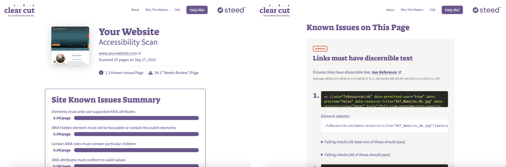

# axe-site-scanner
Axe site scanner is the page scanning portion of [Clearcut Accessibility](https://clearcut.steedgood.com/). You can use it to Axe scan any website.



How it works:
1. Load the front page of the website to be scanned.
2. Crawl the site by following links.
3. Use headless Chrome to run [axe-core](https://github.com/dequelabs/axe-core) on a set number of pages.
4. Use [11ty](https://11ty.dev) to generate pages that explain page-by-page what the accessibility issues are on the site.

How to use this:
1. Clone this repo.
2. NPM install.
3. Create a .env file in the project root that looks like this:
```
DOMAIN_URL="https://mywebsite.com/"
CRAWL_START_URL="https://mywebsite.com/"
URLS_MUST_CONTAIN="https://mywebsite.com/"
SCANNED_SITE_TITLE="My Website"
MAX_PAGES_TO_CRAWL=30
MAX_PAGES_TO_SCAN=30
AXE_SCAN_TAGS="wcag2a,wcag2aa,wcag21a,wcag21aa,section508"
```
4. Run "npm start"